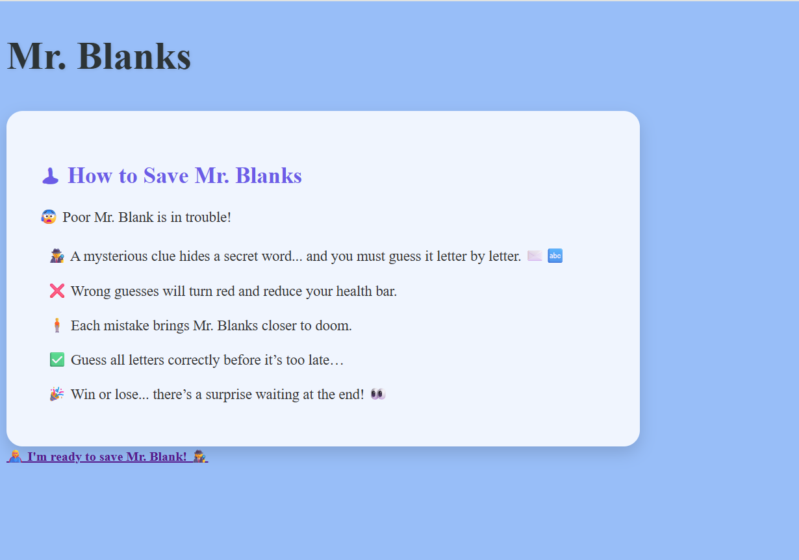
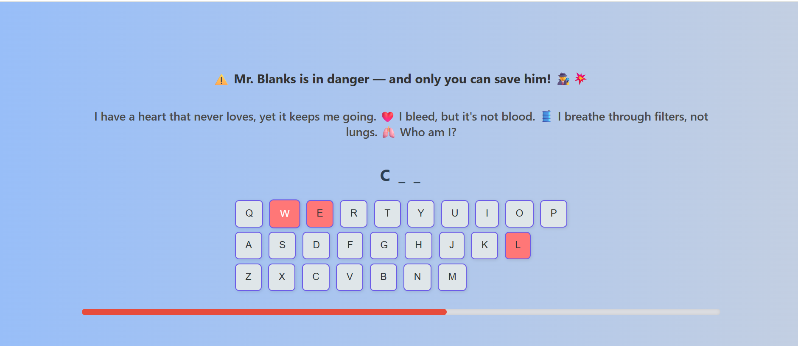

# Mr.blancks

## Date: 30/6/2025

### By: Maryam Salah

#### [Website of the game ]() || [sounds](https://www.linkedin.com/in/michaelglackey/)
***

### ***Description***
#### 
🕹 How to Play Mr. Blanks

Mr. Blanks is in danger — and only you can save him!

Your mission is to guess the hidden word, one letter at a time — using the changing clue to guide you.
You have 7 chances to guess wrong.Each incorrect letter turns red and drains your health bar.
Guess all the letters correctly before the 7th mistake… and you’ll save Mr. Blanks! But if you fail… well, Mr. Blanks is doomed — and you’ll see what happens. 💀🎬

***
### ***Pseudo-code***
🕹 How to Save Mr. Blanks
😰 Poor Mr. Blank is in trouble!

- 🕵️‍♂️ A mysterious clue hides a secret word... and you must guess it letter by letter. ✉️🔤
 - ❌ Wrong guesses will turn red and reduce your health bar.
- 🧍 Each mistake brings Mr. Blanks closer to doom.
- ✅ Guess all letters correctly before it’s too late…
- 🎉 Win or lose... there’s a surprise waiting at the end! 👀

### ***Technologies Used***
- HTML
- CSS
- JS
***

### ***Getting Started***

##### The project was deployed and can be viewed [here](URL).
***

### ***Screenshots***

###

***

### ***Future Updates***

- [ ] Future Update 1
- [ ] Future Update 2
- [x] Completed Update
- [x] ~~Strikethrough~~ Items Also
***

### ***Credits***

##### Funny Images: [DuckDuckGo Search](http://www.duckduckgo.com)

##### Markdown Guide: [ia.net](https://ia.net/writer/support/general/markdown-guide)

##### Markdown Cheatsheet: [GitHub](https://guides.github.com/pdfs/markdown-cheatsheet-online.pdf)
***
