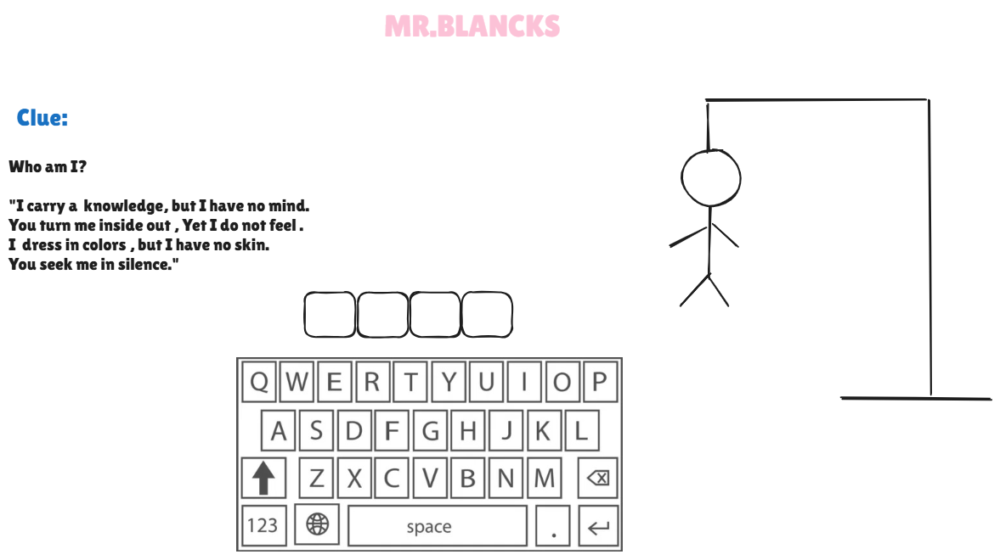

# Mr.blancks

## Date: 30/6/2025

### By: Maryam Salah

#### [Website](https://michaellackey.com/) | [GitHub](https://github.com/NobodysLackey) | [LinkedIn](https://www.linkedin.com/in/michaelglackey/)
***

### ***Description***
#### 
🕹 How to Play Mr. Blanks

Mr. Blanks is in danger — and only you can save him!

Each round, you’ll see a mysterious clue that describes a hidden word.
Your mission is to guess the word letter by letter, using the clue to guide you.You have 7 chances to guess wrong.Each incorrect letter brings Mr. Blanks one step closer to being hanged.Guess all the letters correctly before the 7th mistake… and Mr. Blanks lives!But if you fail… well, you know what happens. 💀

***
### ***Pseudo-code***
- Starts the game	Game: shows a clue and blanks for the word

-Enters a correct letter: 	The letter is revealed in the correct position(s) in the word

- Enters a wrong letter	: Every time you make a mistake, the letter turns red, and one part of Mr. Blanks is drawn: first his head, then his body, followed by his right arm, left arm, right leg, left leg — and on the seventh mistake, his eyes are drawn… and he's dead.

- Repeats a guessed letter	Warning is shown: "You already guessed that!"

- Guesses all letters	Game ends with a win message: "You saved Mr. Blanks!"

-Makes 7 wrong guesses	Game ends with a lose message: "Mr. Blanks is gone..."
- Clicks "Play Again"	A new game round begins with a new word and clue

### ***Technologies Used***
- HTML
- CSS
- JS
***

### ***Getting Started***

##### The project was deployed and can be viewed [here](URL).
***

### ***Screenshots***

###

***

### ***Future Updates***

- [ ] Future Update 1
- [ ] Future Update 2
- [x] Completed Update
- [x] ~~Strikethrough~~ Items Also
***

### ***Credits***

##### Funny Images: [DuckDuckGo Search](http://www.duckduckgo.com)

##### Markdown Guide: [ia.net](https://ia.net/writer/support/general/markdown-guide)

##### Markdown Cheatsheet: [GitHub](https://guides.github.com/pdfs/markdown-cheatsheet-online.pdf)
***
